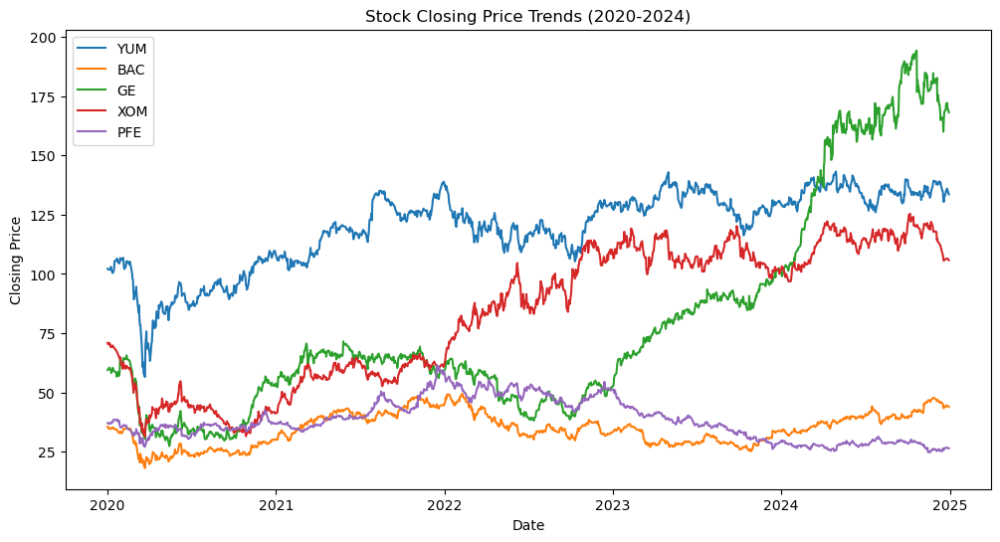
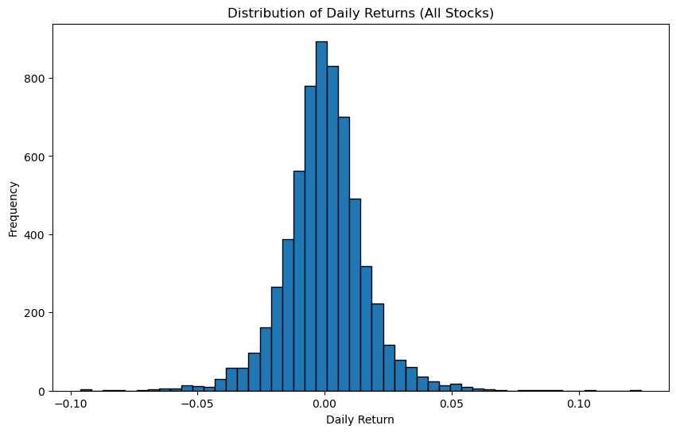
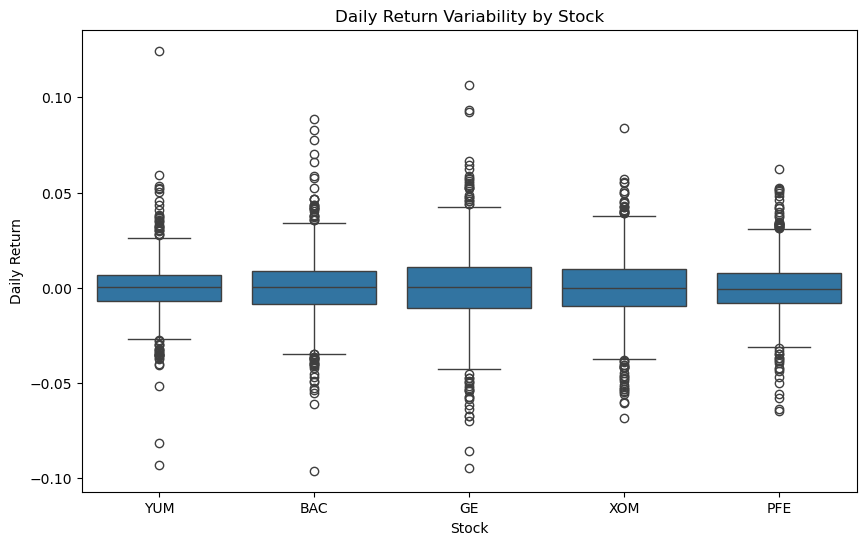
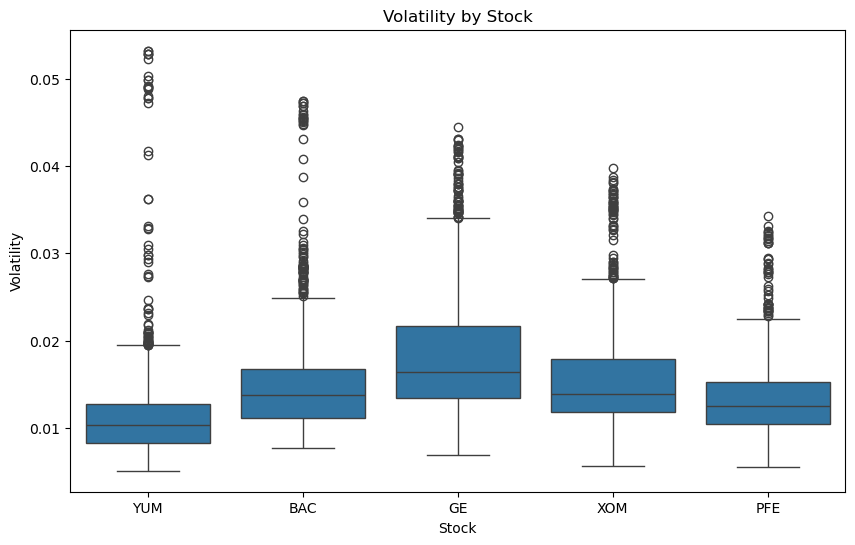
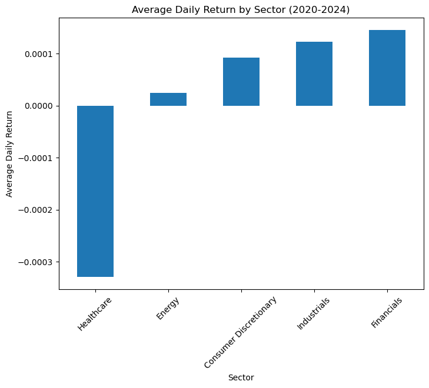
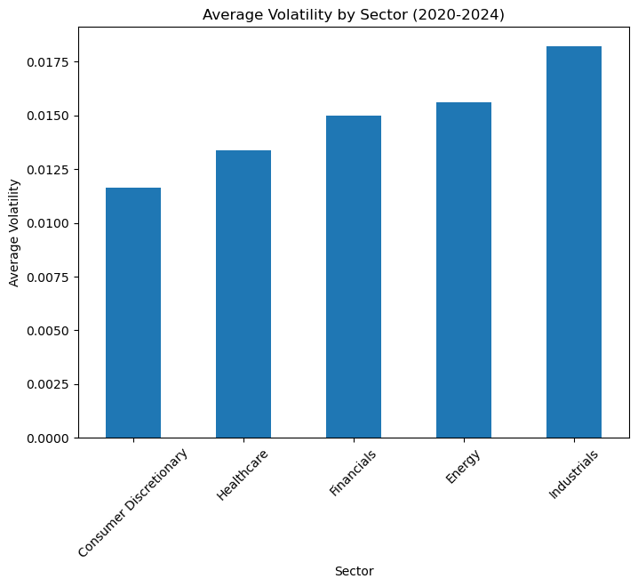

# Stock Performance & Volatility Analysis (2020-2024)

## Overview

This project analyzes the historical stock performance and volatility of selected companies from 2020 to 2024, across multiple sectors.

**Objective:**
- Analyze historical stock performance and volatility.
- Compare performance during normal periods and during the COVID-19 crash (March 2020).
- Identify which stocks and sectors showed the highest returns and risks.

**Stocks analyzed:**
YUM, BAC, GE, XOM, PFE

**Sectors analyzed:**
Consumer Discretionary, Financials, Industrials, Energy, Healthcare

---

## Project Structure

- `data/`: Cleaned data used for analysis.
- `notebooks/`: Jupyter notebook with all code, analysis, and visualizations.
- `visuals/`: Exported charts in `.png` format.
- `reports/`: Exported report (PDF/HTML).
- `scripts/`: Data cleaning and preparation script.

---

## Important Note

**For best viewing experience, please open the notebook directly on GitHub.  
Images are referenced via Markdown and may not appear correctly in PDF exports or local file previews.**

---

## Key Insights

| Observation                                                | Implication                                             | Recommendation                                                   |
|------------------------------------------------------------|---------------------------------------------------------|------------------------------------------------------------------|
| GE and XOM showed the strongest price growth from 2020 to 2024. | Suggests long-term growth potential. | Consider for growth-focused portfolios if momentum persists. |
| Healthcare had the lowest average daily return across all sectors. | Consistent underperformance in daily returns. | Review the sector before allocation. |
| During the March 2020 crash, BAC, GE, and XOM saw the steepest declines. | Financials and Industrials were highly sensitive to the COVID crash. | Monitor these sectors during global events. |
| PFE was the most resilient stock during the March 2020 crash. | Healthcare showed defensive characteristics. | Consider for diversification and risk protection. |

---

## Sample Visualizations

### Closing Price Trends (2020-2024)

### Distribution of Daily Returns

### Daily Return Variability by Stock

### Volatility by Stock

### Average Daily Return by Sector

### Average Volatility by Sector

---

## Limitations

- Analysis focused only on historical data (2020-2024), no predictive modeling.
- Volatility calculated using 20-day rolling standard deviation.
- COVID-19 analysis limited to March 2020 crash only.
- No dividends, splits, or broader macroeconomic factors included.

---

## Author

Cody Stuerman  
Data Analyst (SQL, Python, Tableau)  
[LinkedIn](https://www.linkedin.com/in/codystuerman)
